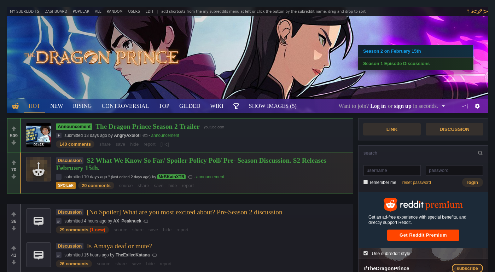

> Easy to setup theme development project, primarily for [r/TheDragonPrince](https://old.reddit.com/r/TheDragonPrince)

[](LICENSE)
[](package.json)
[](https://travis-ci.org/flowzy/r-thedragonprince)



# Table of Contents
- [Browser support](#browser-support)
- [Getting started](#getting-started)
  - [Prerequisites](#prerequisites)
  - [Installation](#installation)
  - [Usage](#usage)
- [Contributing](#contributing)
- [Acknowledgment](#acknowledgment)
- [MIT License](#mit-license)

# Browser support
Because Reddit's limit for stylesheet is only 100 Kb, cross-browser support is not the priority, so officially the project supports only the latest version of current desktop browsers. But, at the time of writing this, here's a list of browsers that, on paper, _should_ fully support currently used features:

| Browser | Version |
|---------|---------|
| Edge    | latest  |
| Firefox | ≥ 36    |
| Chrome  | ≥ 31    |
| Opera   | ≥ 26    |
| Safari  | ≥ 10    |

# Getting started
Before you start working on the project, you need go through a couple of steps to setup your environment.

## Prerequisites
Download and install the following software:
* [NodeJS](https://nodejs.org/en/download/)
* [Yarn](https://yarnpkg.com/)
* [git](https://git-scm.com/downloads) (recommended, but not required)
* [Tampermonkey](https://chrome.google.com/webstore/detail/tampermonkey/dhdgffkkebhmkfjojejmpbldmpobfkfo) (for Chrome) or [Greasemonkey](https://addons.mozilla.org/en-US/firefox/addon/greasemonkey/) (for Firefox)

After you've done that, you now need to allow your browser to connect to "insecure" localhost:
* Chrome
    * visit [chrome://flags/#allow-insecure-localhost](chrome://flags/#allow-insecure-localhost)
    * choose "Enabled" from the dropdown list
    * restart your browser
* Firefox
    * visit https://localhost:8080/
    * click "Advanced"
    * then click "Add Exception..."
    * _at this step, if the certificate is not showing up, click "Get Certificate"_
    * add the exception by clicking "Confirm Security Exception"
    * P.S. you _might_ need to do this every time you restart your machine

## Installation
Now that you've setup your environment, you can start downloading and installing the project.

1. Clone the repository and `cd` into it:
    ```bash
    $ git clone https://github.com/flowzy/r-thedragonprince.git
    $ cd ./r-thedragonprince
    ```
    > _or download the project as a ZIP archive._

2. Install dependencies, using Yarn:
    ```
    $ yarn install
    ```
3. Open [this link](https://github.com/flowzy/r-thedragonprince/raw/master/userscript.user.js) and install the userscript.
4. At this point you should be all set and ready to go.

### Having issues why trying to install dependencies?

If you're on Windows, try this:

1. _(optional)_ Install **Python** from the [official website](https://www.python.org/).
2. Run the following command to install the **Windows Build Tools** using an elevated _(Administrator)_ terminal window which installs the **VS Build Tools** and also **Python 2.7**:
    ```
    $ npm install --global --production windows-build-tools
    ```

    

The installation **Windows Build Tools** may take a couple of minutes, so after it's complete, re-open the terminal _(normally)_ and run `yarn install` again.

_credit goes to [Catalin Vasile](https://catalin.me/how-to-fix-node-js-gyp-err-cant-find-python-executable-python-on-windows/) for figuring this out_

## Usage
Generate SSL certificates, start a local development server and watch for file changes:
```
$ yarn dev
```

Compress images/CSS output size and rewrite `url(...)` values to comply with Reddit's syntax:
```
$ yarn prod
```

Combine both of the above tasks, without rewriting `url(...)`:
```
$ yarn prod-test
```

Run the task above, but without image compression (useful for users with weaker CPUs):
```
$ yarn prod-test-light
```

Compile SASS with a pre-defined header variant, pass `--env.header` argument:

```
$ yarn <task> --env.header=<number>
---------------------------------------------------
<task>   - dev | prod | prod-test | prod-test-light
<number> - min: 1, max: 18
```

Run tests on the production-ready bundle to determine its compatibility with Reddit's limits:

```
$ yarn test
```

# Contributing
Pull requests are welcome. For major changes, please open an issue first to discuss what you would like to change.

# Acknowledgment
[@ncla](https://github.com/ncla) and his project "[musereddit](https://github.com/ncla/musereddit)" was a great starting point and helped me kickstart the initial development. The project still uses a slightly modified version of his userscript for live development.

### [MIT License](LICENSE)
